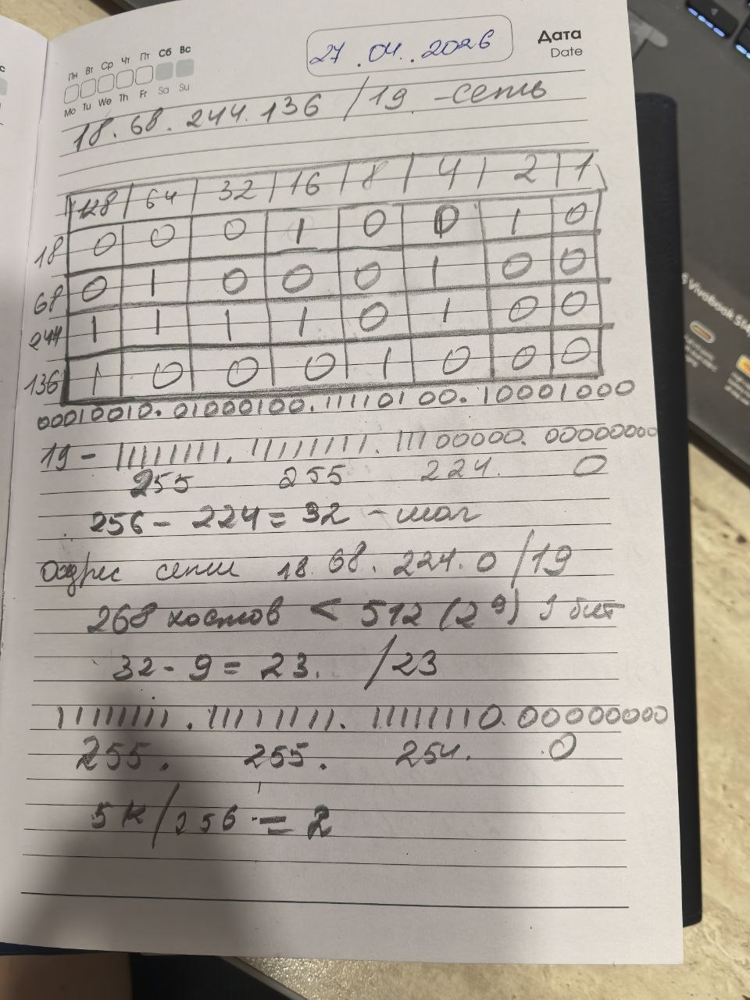
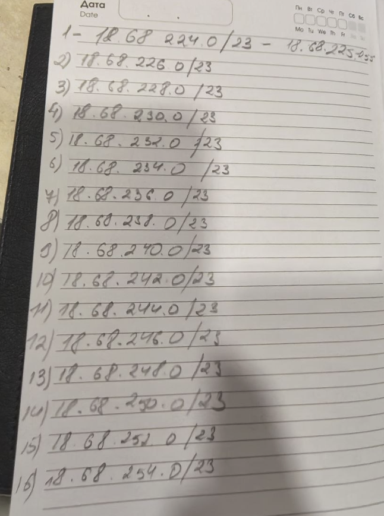
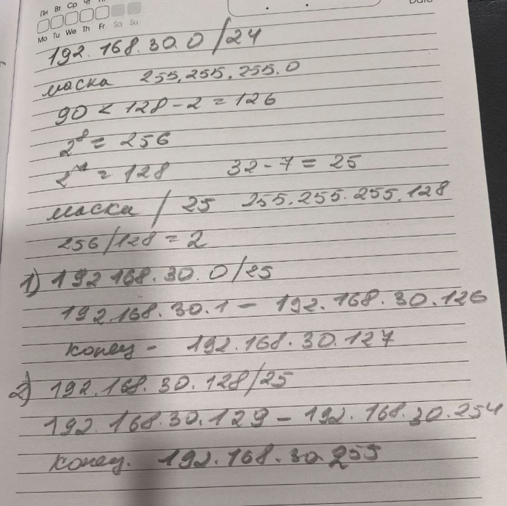

# отчет по выполнению заданий Компьютерные сети
## Задание 1: Разбить на подсети сеть из 268 хостов, с учётом градации классности сетей. Количество подсетей не ограничено. Расписать для каждой подсети: 19. 18.68.244.136/19  

## Задание 2: 19. Имеется сеть 192.168.30.0/24, разбить на подсети с не менее чем 90 доступными адресами.

