# отчет по выполнению задания Unix
## Задание 1: Команда pwd - показал абсолютный путь   
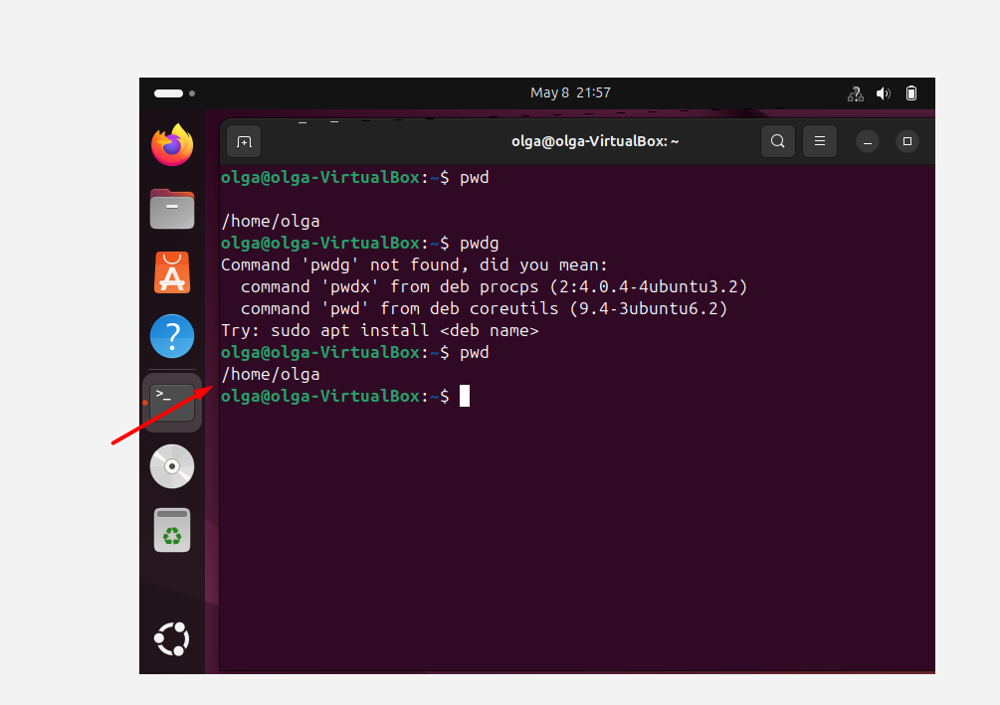

## Задание 2: mkdir dir1 dir2 - создало 2 папки, команда ls - показало список содержимого в домашней папке с новыми созданными папками

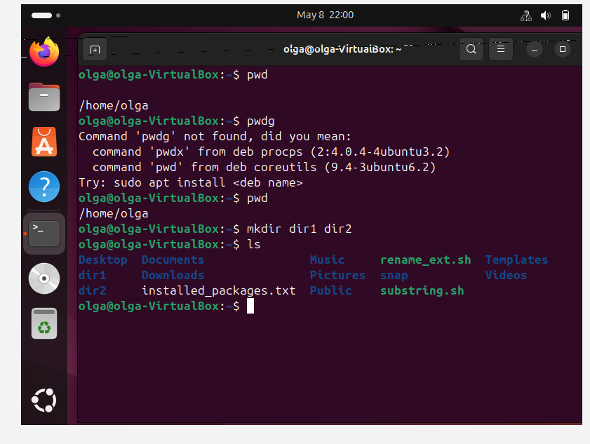

## Задание 3: cd / - переместила в корневую директорию, команда ls - показала список содержимого в корне. ls ~ показало содержимое домашней папки не выходя из корня

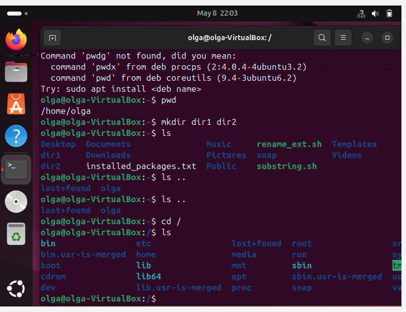
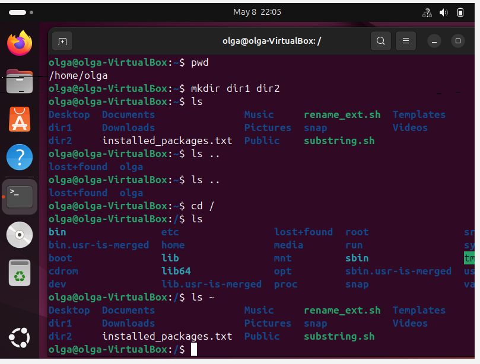

## Задание 4: rmdir dir1 dir2 - удалило пустые папки
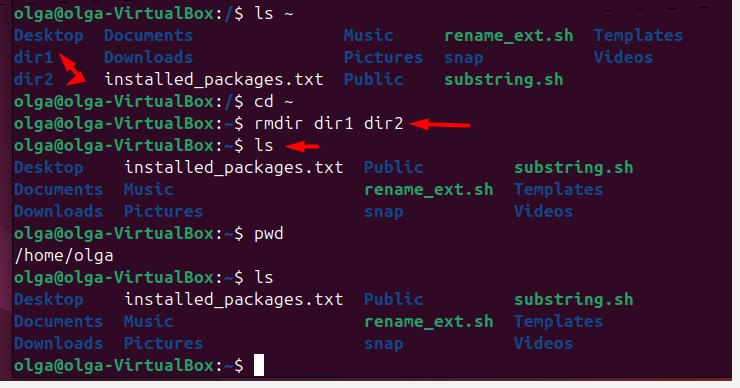

## Задание 5,6,7: информация о команде - man ls, whatis ls, info ls

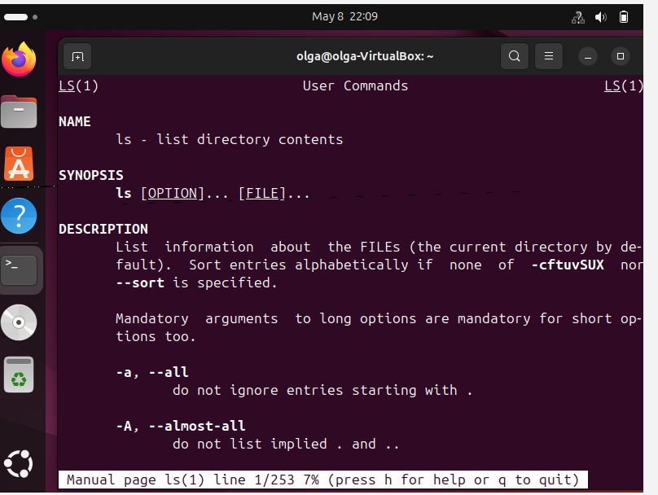
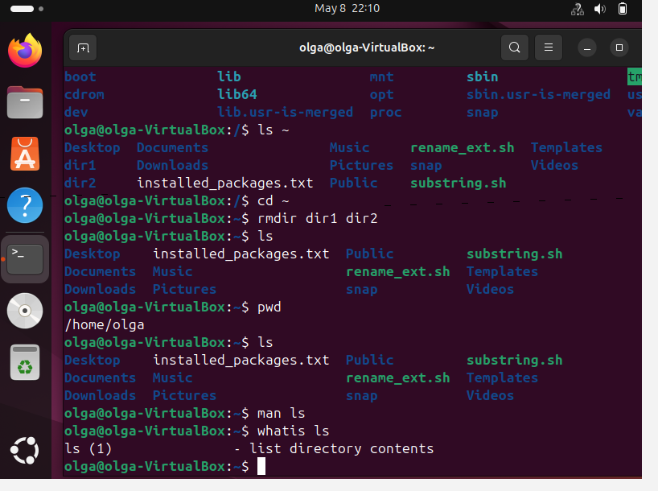
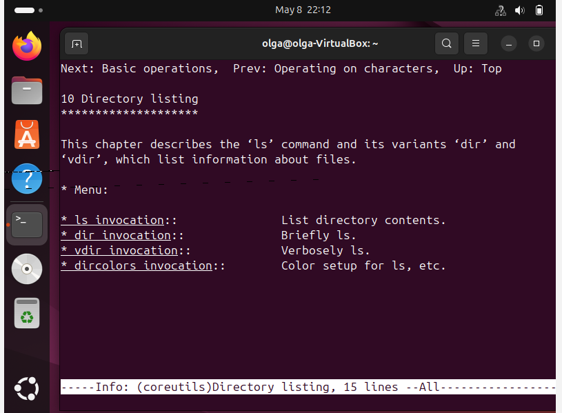

## Задание 8: mkdir -p Grisgina/1/2 - Создало папку Гришина и в ней папку 1, в папке 1 - папку 2. mkdir Grisgina/1/3 - создало папку 3 внутри папки 1, которая находится в папке Гришина. mkdir Grisgina/4 - создало папку 4 в папке Гришина. tree Grisgina - показало струкутру папки

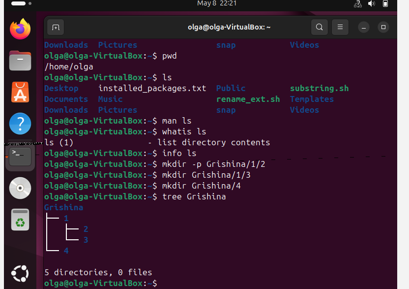

## Задание 8: head -n 13 /etc/group - показало первые 13 строк в файле. tail -n 13 /etc/group - показало последние 13 строк в файле.

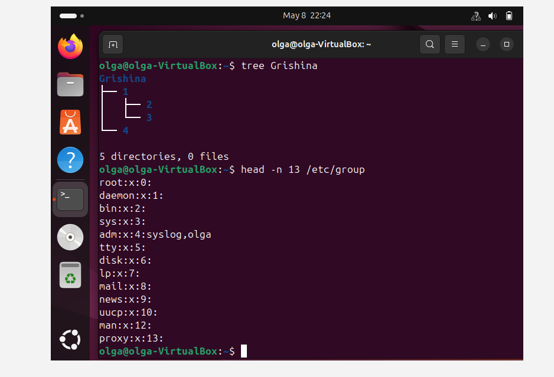
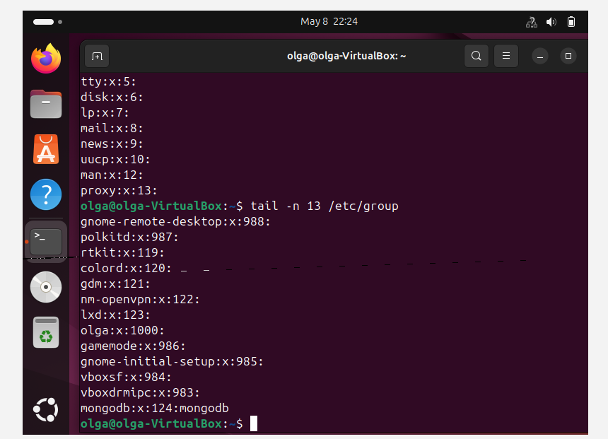