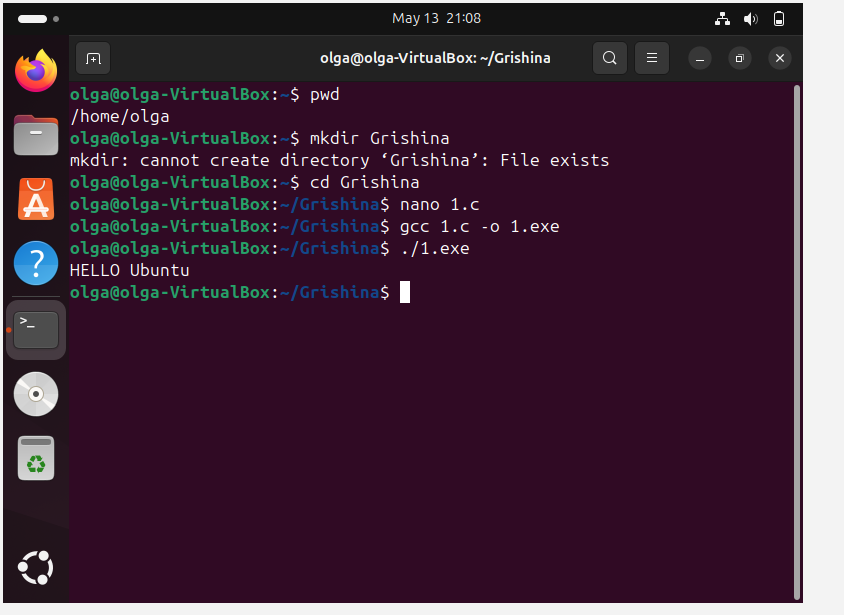
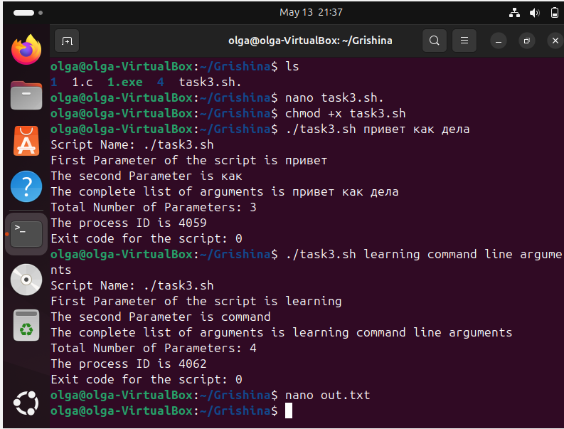
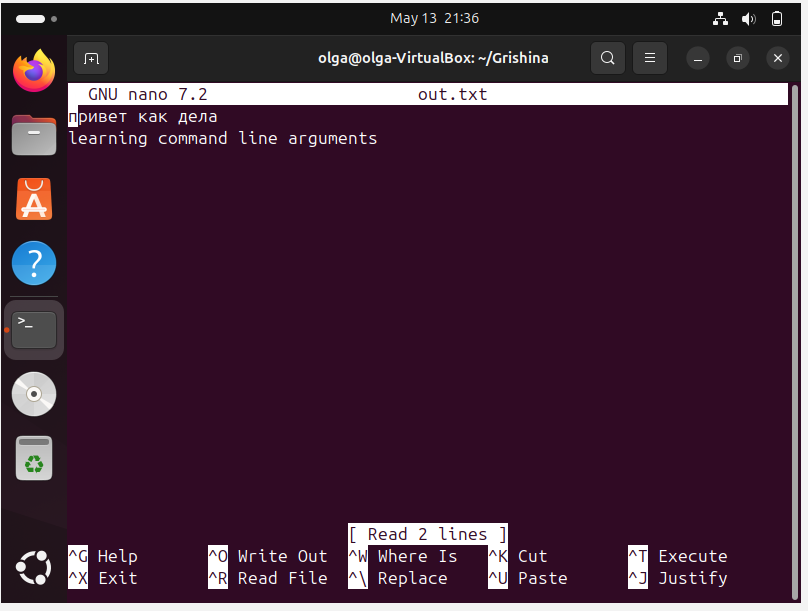
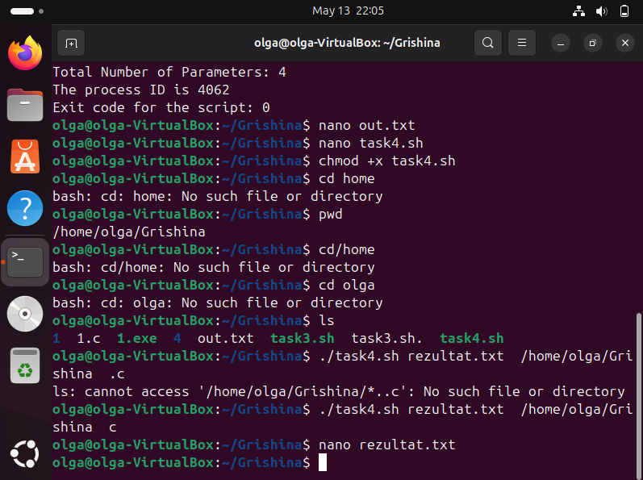
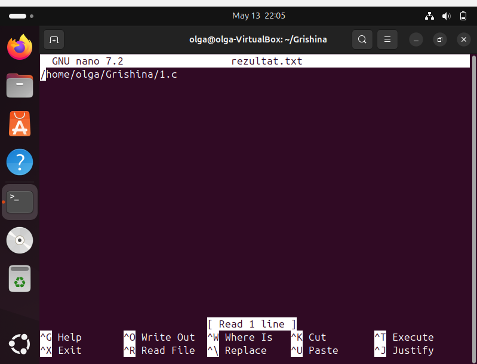

# отчет по выполнению задания L12
## Задание 1-2: программа по выведению фразы "HELLO Ubuntu"

## Задание 3: скрипт, выводящий аргументы в консоль и в файл. Скрипт:
#!/bin/sh
echo "Script Name: $0"
echo "First Parameter of the script is $1"
echo "The second Parameter is $2"
echo "The complete list of arguments is $@"
echo "Total Number of Parameters: $#"
echo "The process ID is $$"
echo "Exit code for the script: $?"

echo "$@" >> out.txt

## Задание 4: скрипт, выводящий аргументы в консоль и в файл
#!/bin/bash

FILE_FOR_LIST=$1   
FOLDER_TO_SCAN=$2  
EXTENSION=$3     

ls "$FOLDER_TO_SCAN"/*."$EXTENSION" > "$FILE_FOR_LIST"

