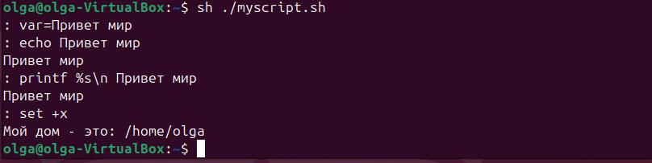
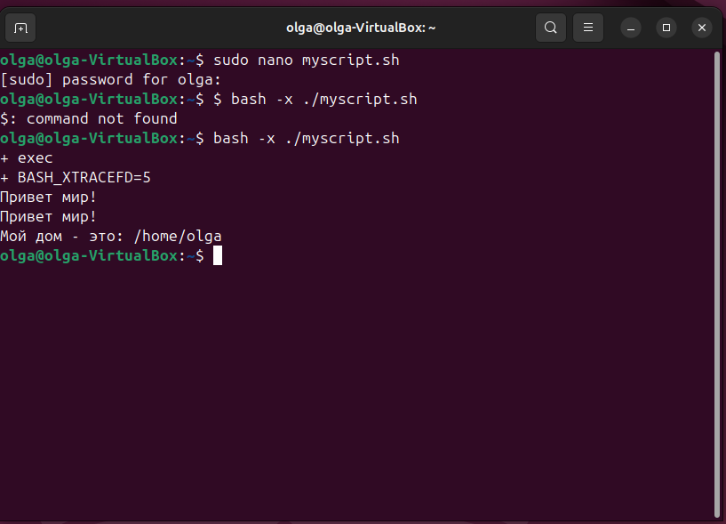
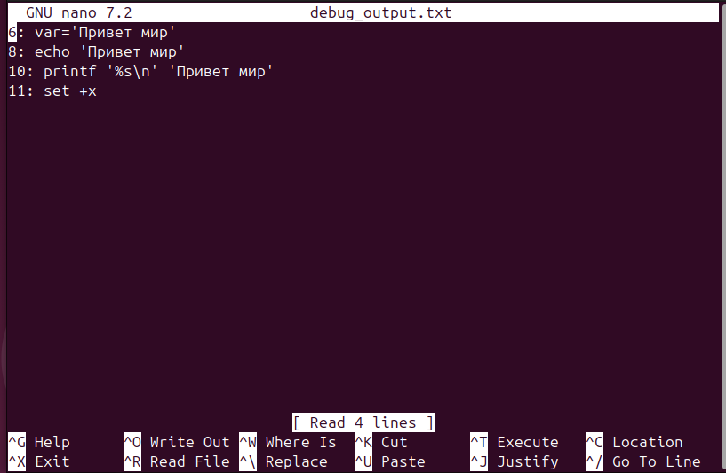
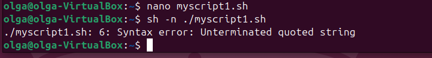
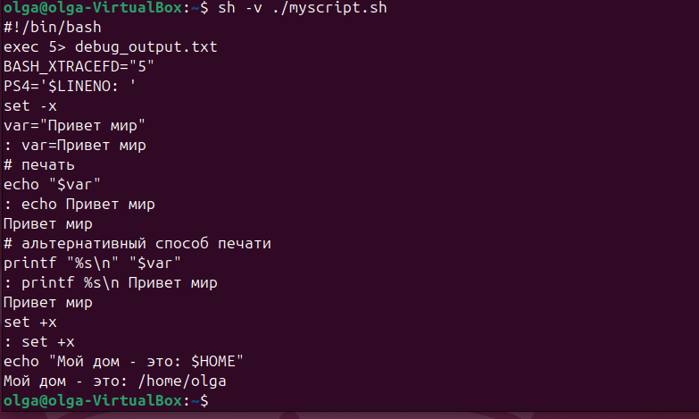
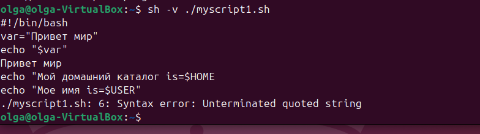
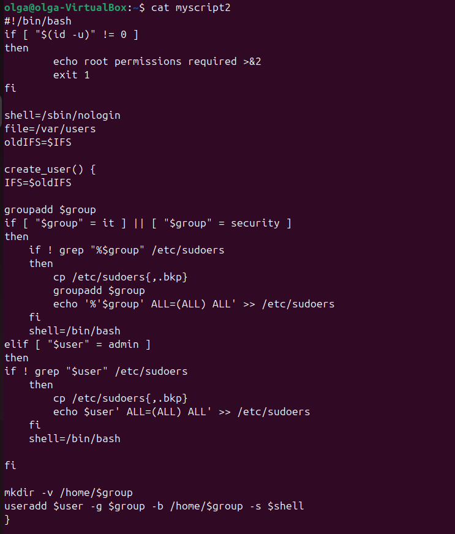
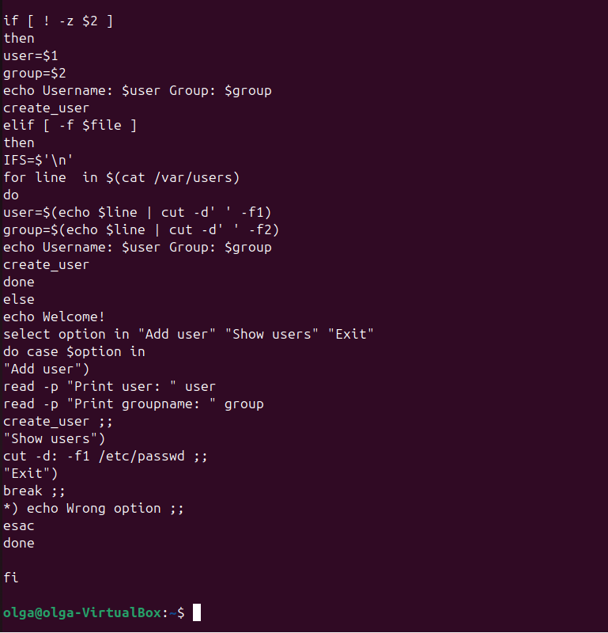

# отчет по выполнению задания L14
## Задание 1: команда $ bash -x ./script_name.sh

## Задание 2: команда $ sh –n ./script_name

## Задание 3: команда $ sh –v ./script_name

## Задание 4: скрипт из задания два

