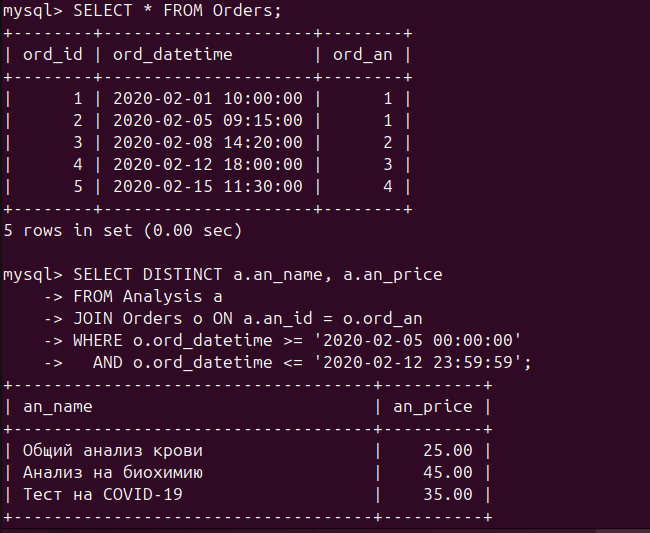
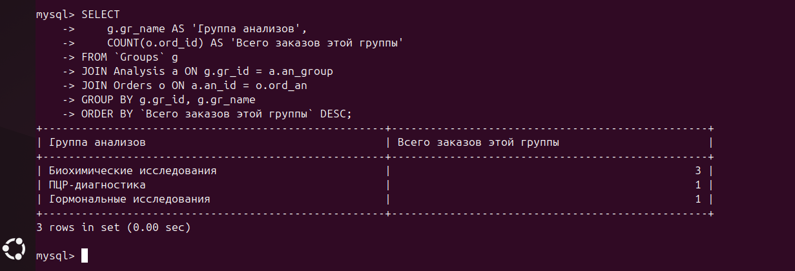
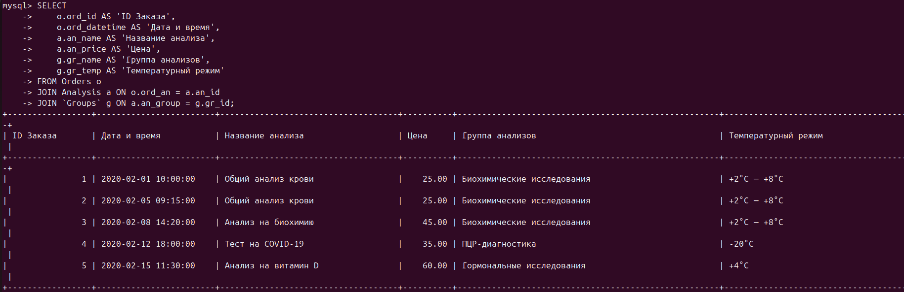
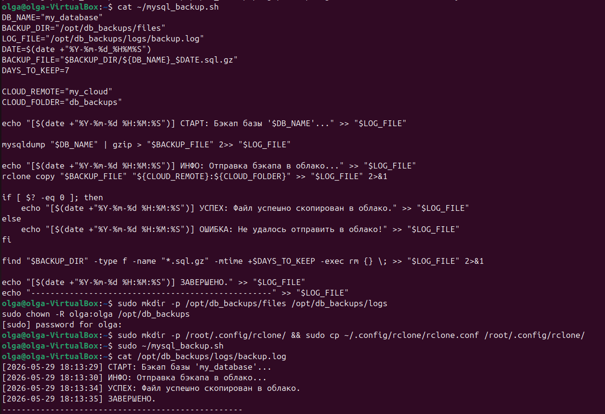
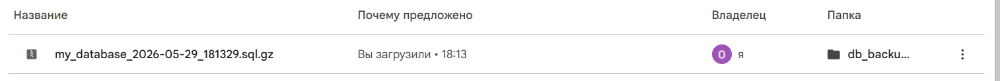
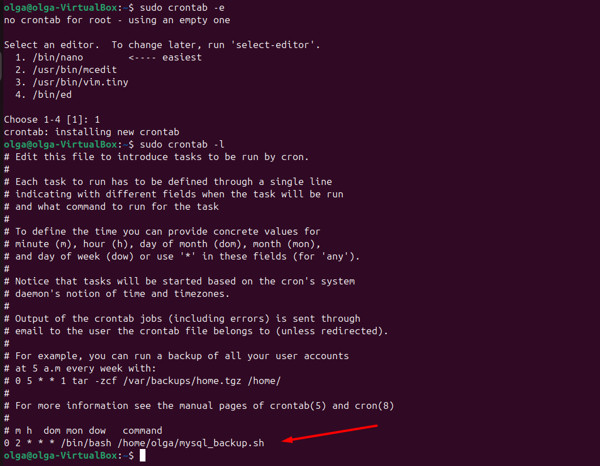
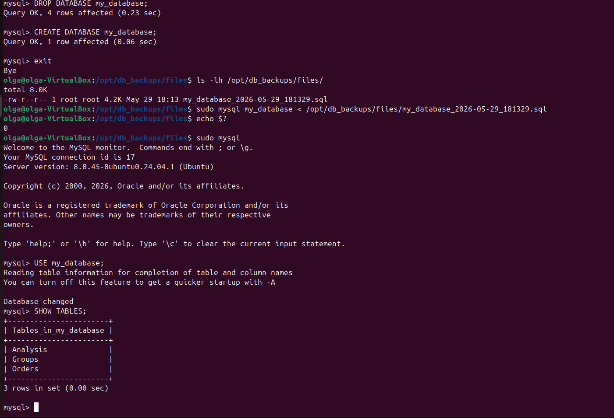

# отчет по выполнению задания L17
## Задание 1: Установка MySQL , создание бд/таблиц, запросов

## Задание 3: Создание скрипта по бэкапу бд, , сохранение архивированного файла в гугл-диск

## Задание 3: Создание крона

## Задание 3: Востановление бд после дроп бд
