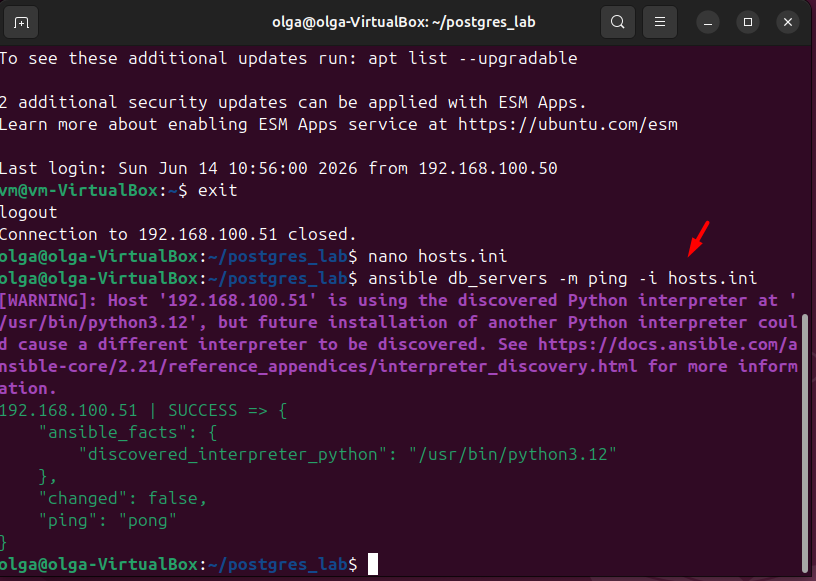
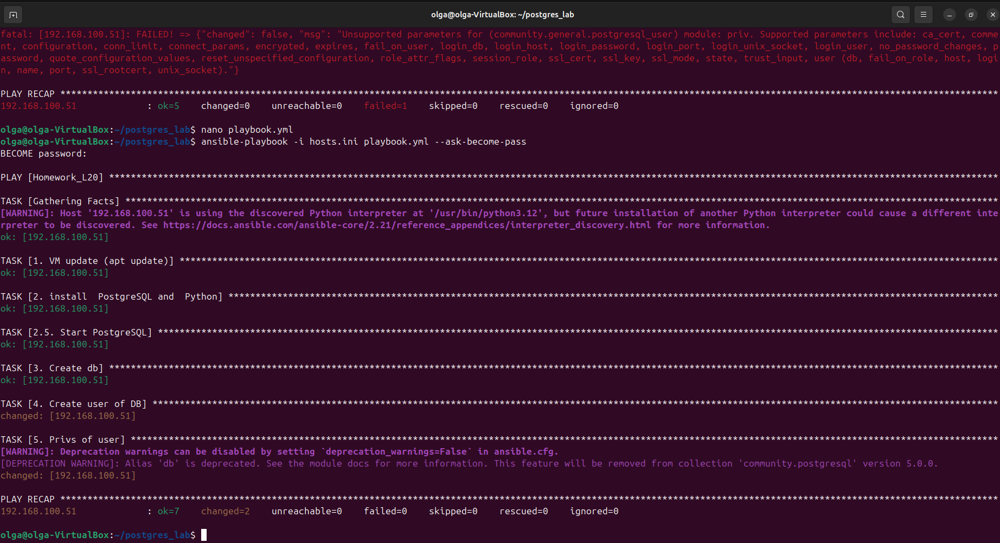
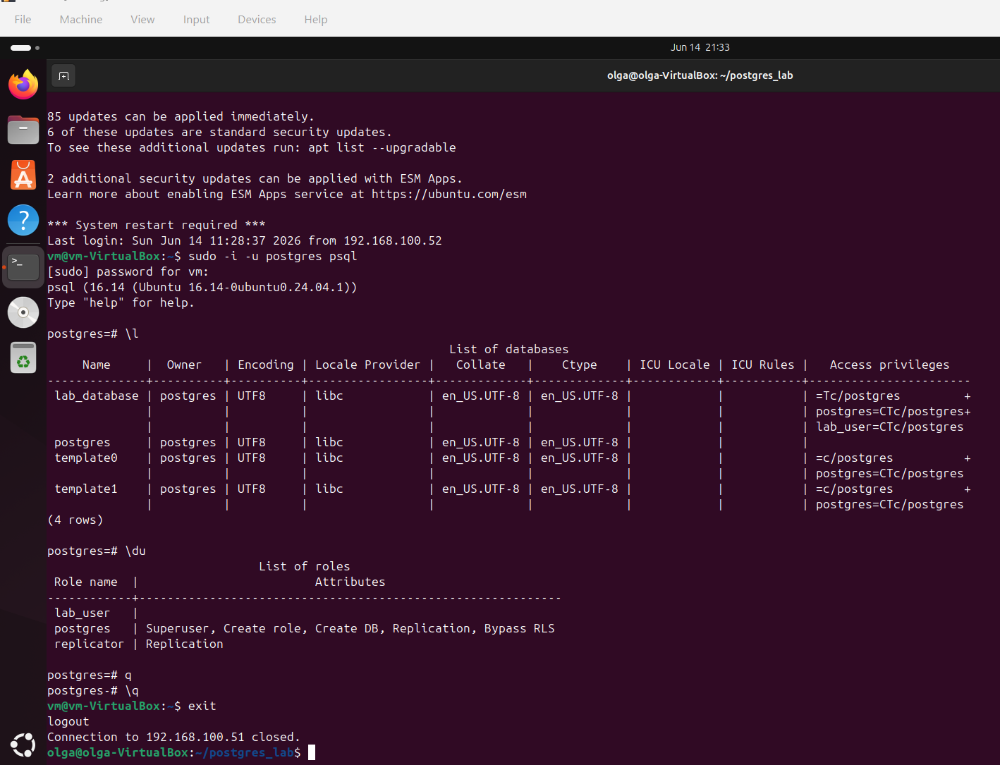

# отчет по выполнению задания L20
## Задание 1: Создание файла инвентаря и проверка связи с другим сервером

## Задание 2: создание плейбука на создание БД и эзера БД от пользователя root

## 3: проверка создание БД и пользователя на другой виртуальной машине

