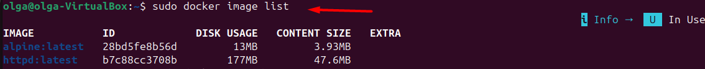
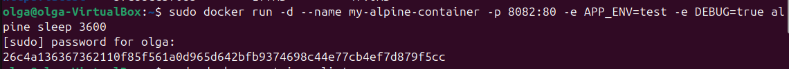
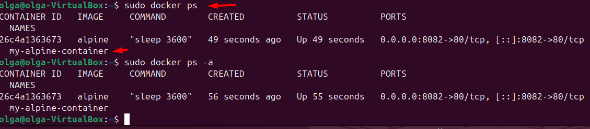
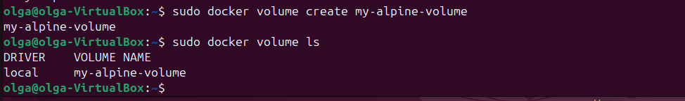
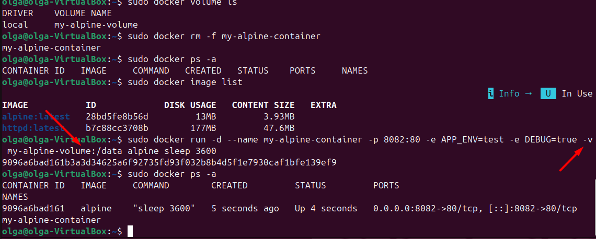
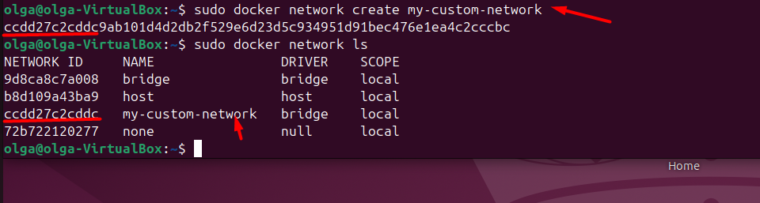
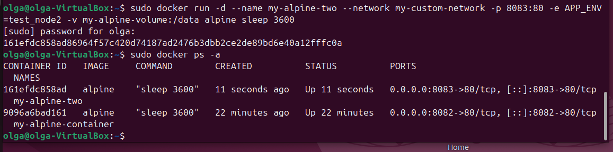
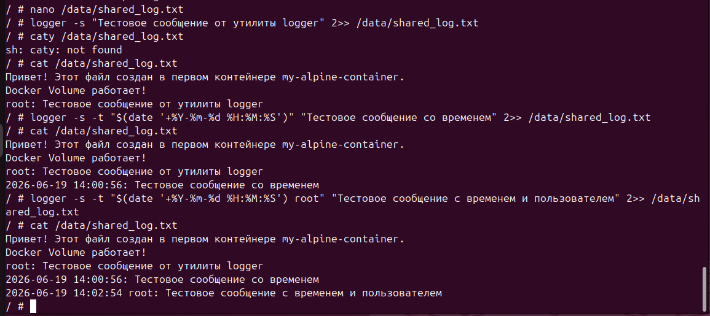
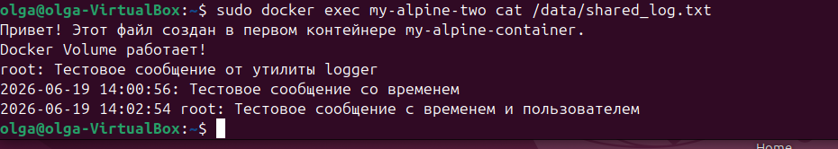
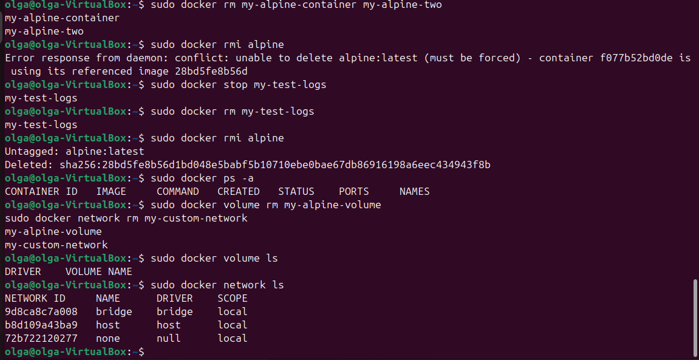

# отчет по выполнению задания L23
## Задание 1: Скачать образ; запустить контейнер на основе скаченного образа; убедиться, что контейнер запущен

## Задание 2: Создать том; запустить контейнер с подключением к тому; создать свою сеть

## Задание 3: Запустить второй контейнер, присоединив к созданной ранее сети и к тому; создать текстовый файл в подключенном томе внутри первого контейнера;через утилиту logger сделать записи в созданный файл; проверить содержимое файла из второго контейнера

## Задание 3: Использовать команду docker logs

## Задание 4: Остановить контейнеры; удалить: контейнеры, образ, том, сеть
