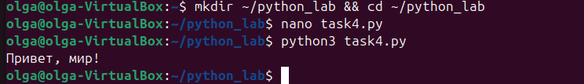
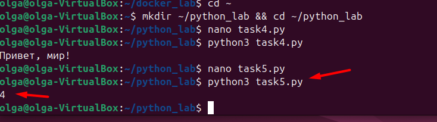
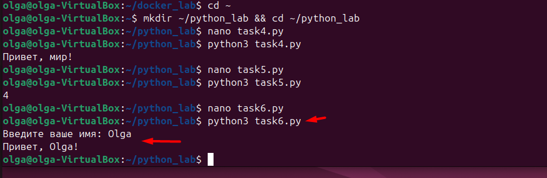
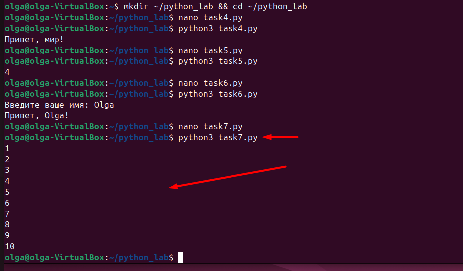
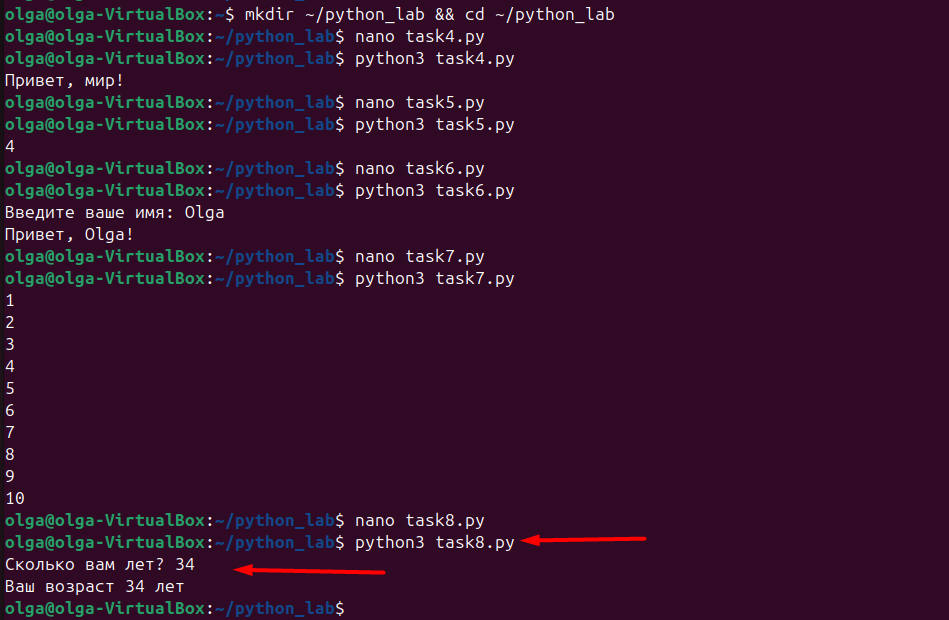
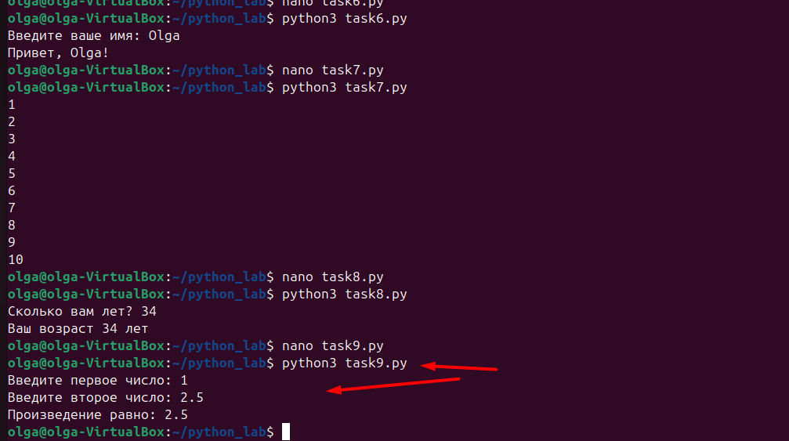
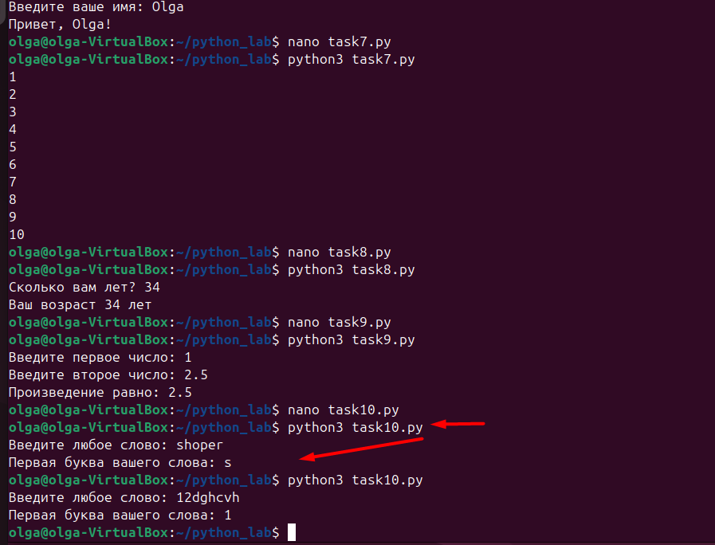
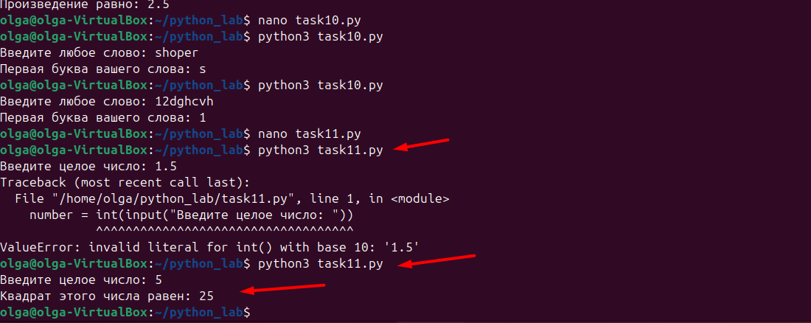
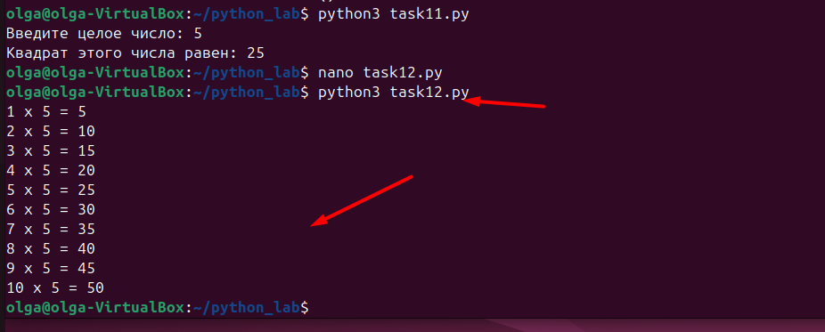
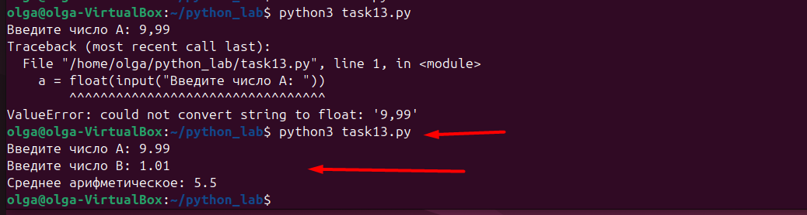

# отчет по выполнению задания L_25
## Задание 4: Вывод фразы на экран

## Задание 2: Вывод сложения 2+2

## Задание 3: Вывод имени пользователя

## Задание 4: Вывод числа от 1 до 10

## Задание 5: Вывод возраста пользователя

## Задание 6: Произведение двух чисел

## Задание 7: Вывод первой буквы слова

## Задание 8: Вывод квадрата целого числа

## Задание 9: Вывод таблицы умножения на 5

## Задание 10: Вывод среднее арифмитического двух чисел
