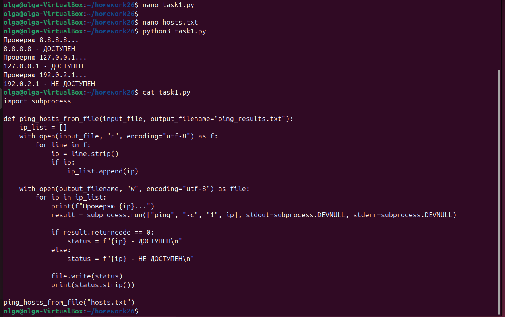
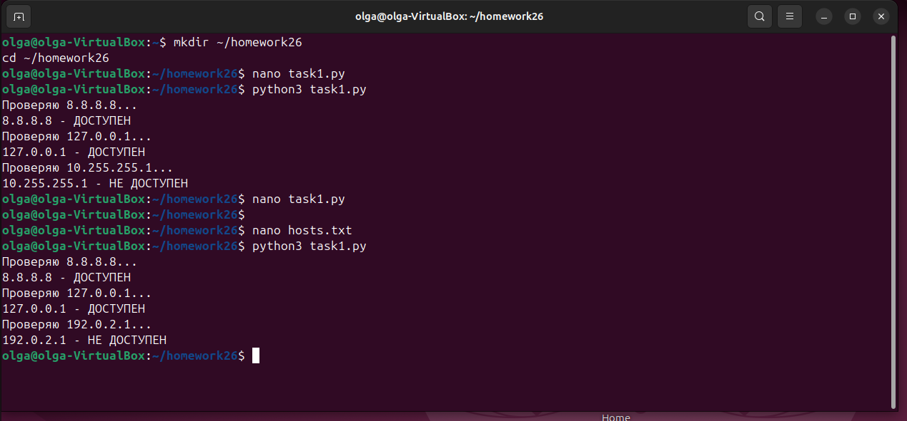
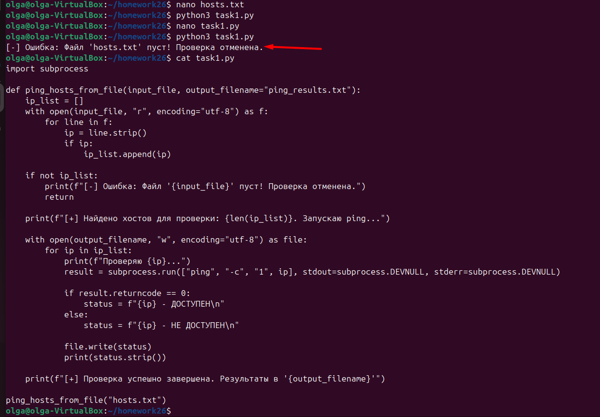
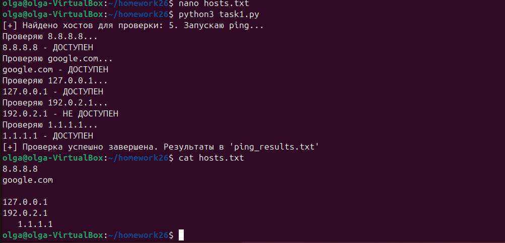

# отчет по выполнению задания L_26
## Задание 1: Написать скрипт, который принимает списко IP-адресов и пингует их

## Задание 2: Проверка выполнения скрипта

## Задание 3: Проверка пустого файла хостов и редактирование скрипта для такого сценария

## Задание 4: Проверка выполнения скрипта при следующих сценариях: 1 - рабочий IP, 2 - Буквенный домен вместо IP, 3 - Пустая строка, 4 - Localhost, 5 - нерабочий IP, 6 - Адрес с пробелами по бокам

