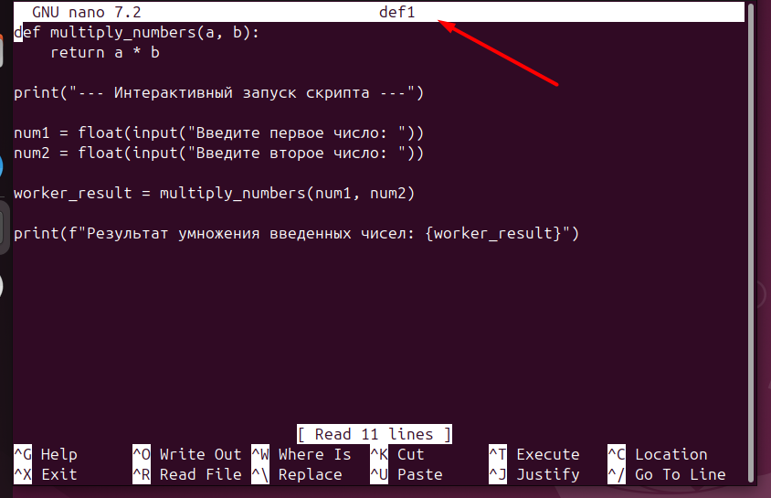
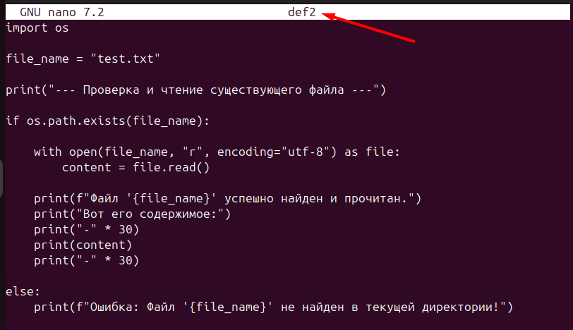
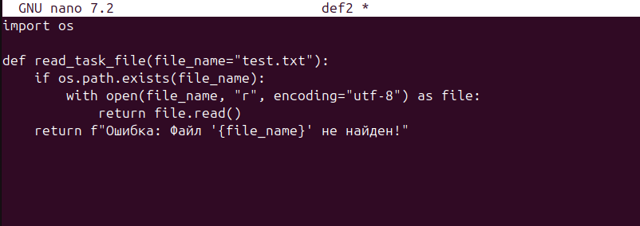
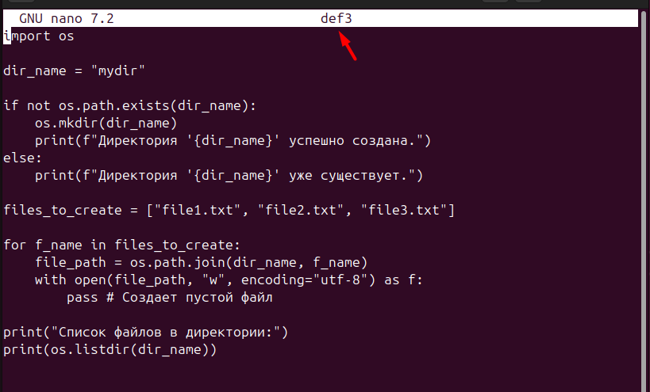
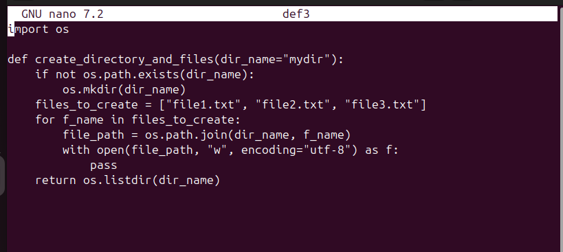
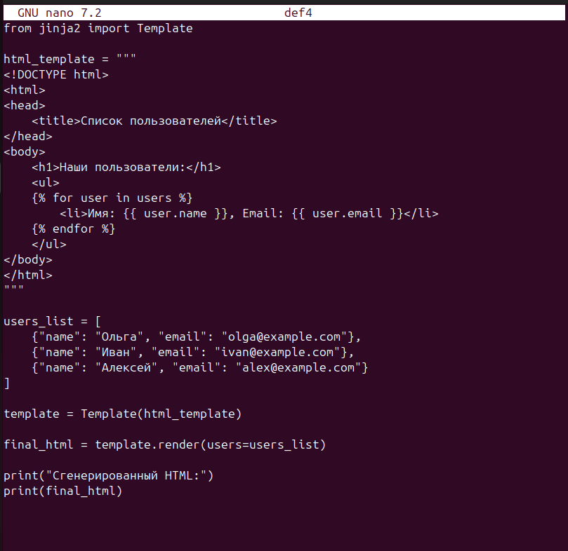
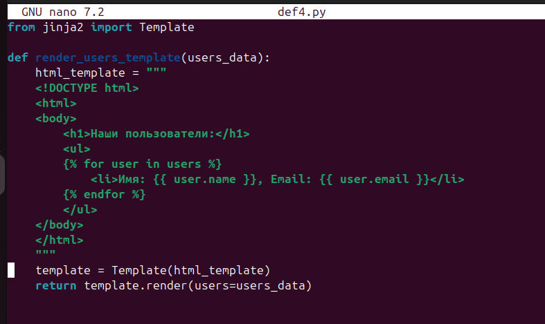
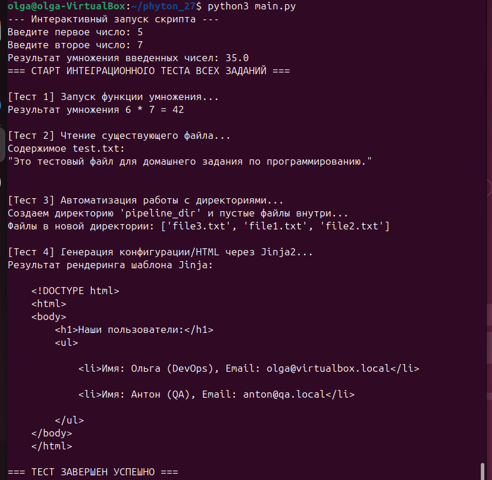

# отчет по выполнению задания L_27
## Задание 1: Функция умножения

## Задание 2: Запись и чтение файла

## Задание 2: оптимизация под объединение

## Задание 3: Создание директории и файлов

## Задание 3: оптимизация под объединение

## Задание 4: Шаблонизатор Jinja

## Задание 4: оптимизация под объединение

## Задание 5: объединить все задания в один проект

