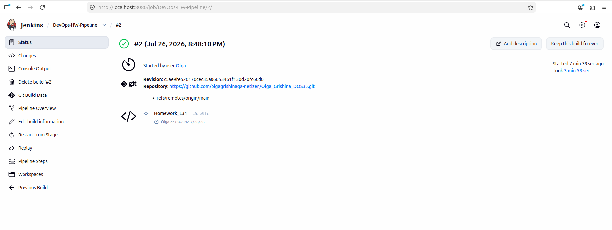
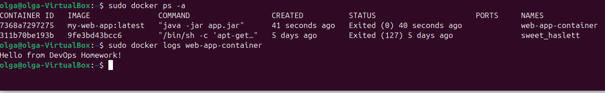

# отчет по выполнению задания L_31
## Задание 1: Сформирован и отлажен Jenkins Pipeline, состоящий из трёх основных этапов: 1. Checkout SCM: получение актуального кода из Git-репозитория GitHub. 2. Build & Test: сборка приложения, упаковка в JAR и прохождение тестов средствами Maven. 3. Deploy to Container: сборка Docker-образа (my-web-app:latest) и перезапуск контейнера (web-app-container).

