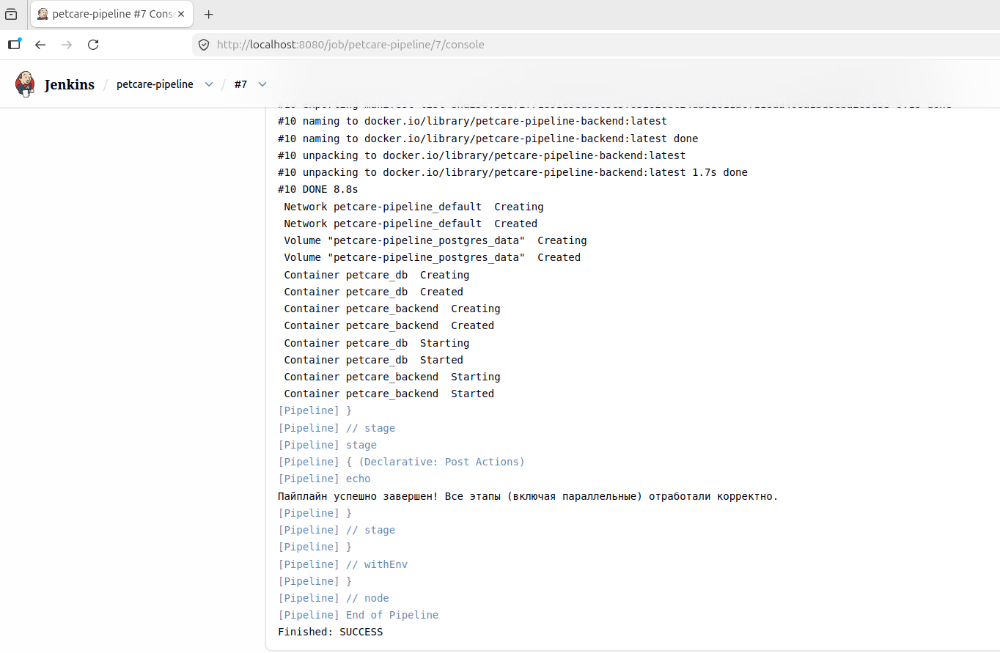

# отчет по выполнению задания L_32
## Задание 1: настроено параллельное выполнение скачивания кода, параллельная проверка кода, сборка Docker-образ бэкенда проекта, выполние команды деплоя через docker compose

