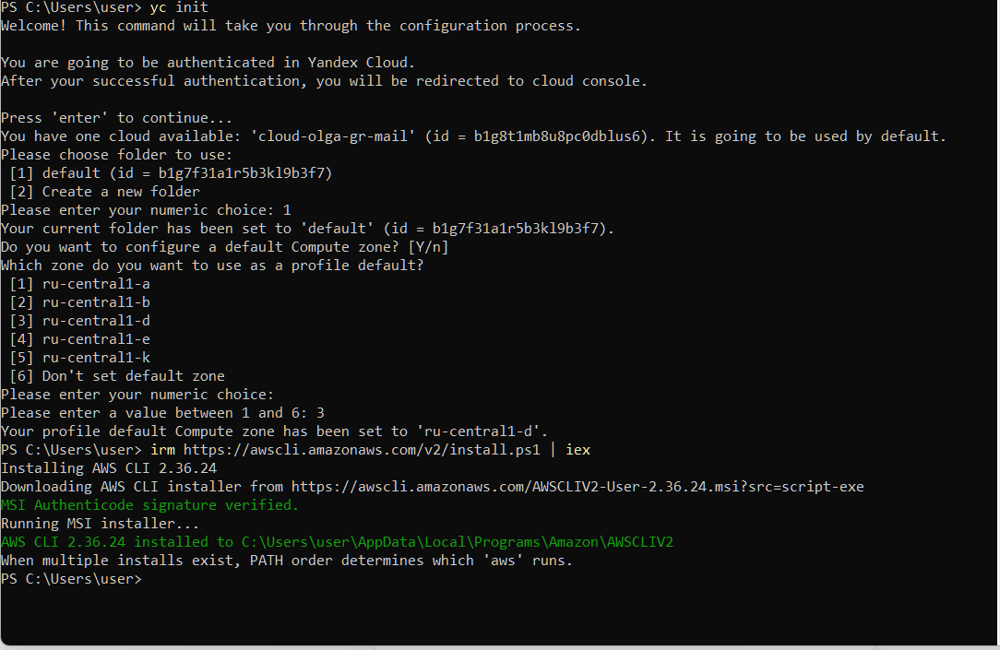
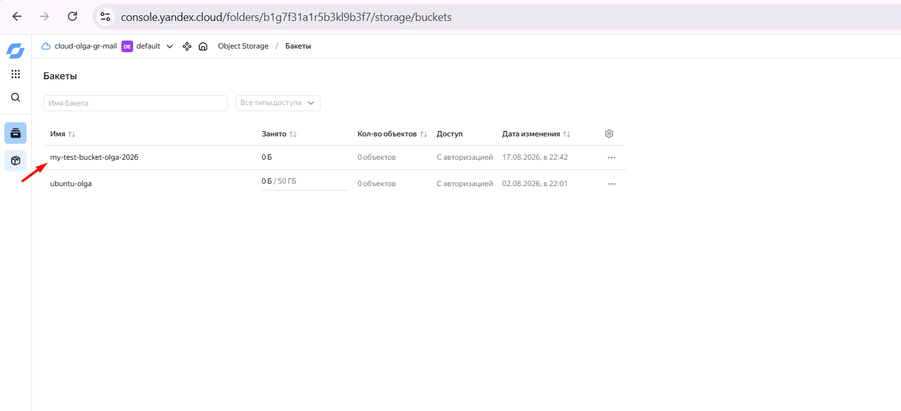
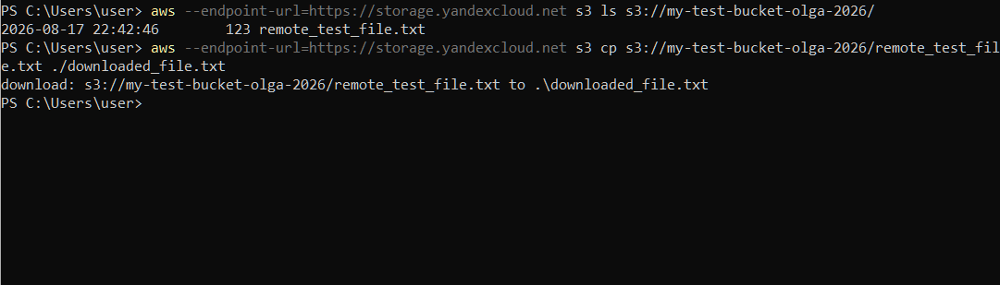
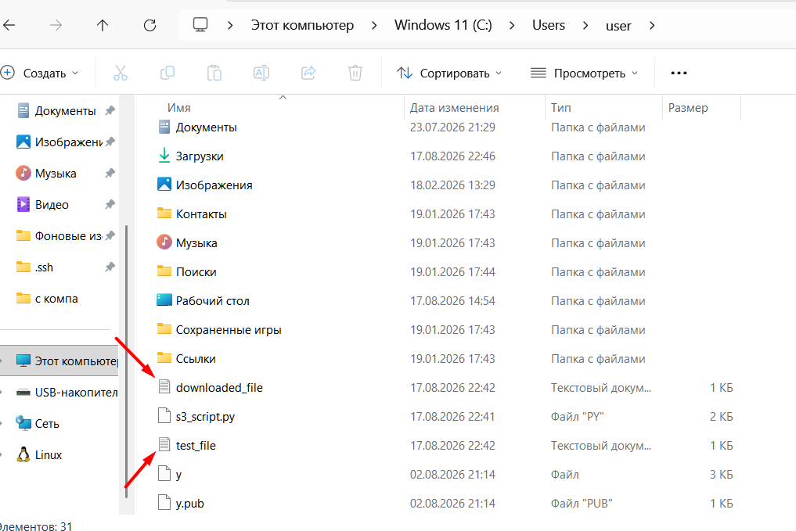
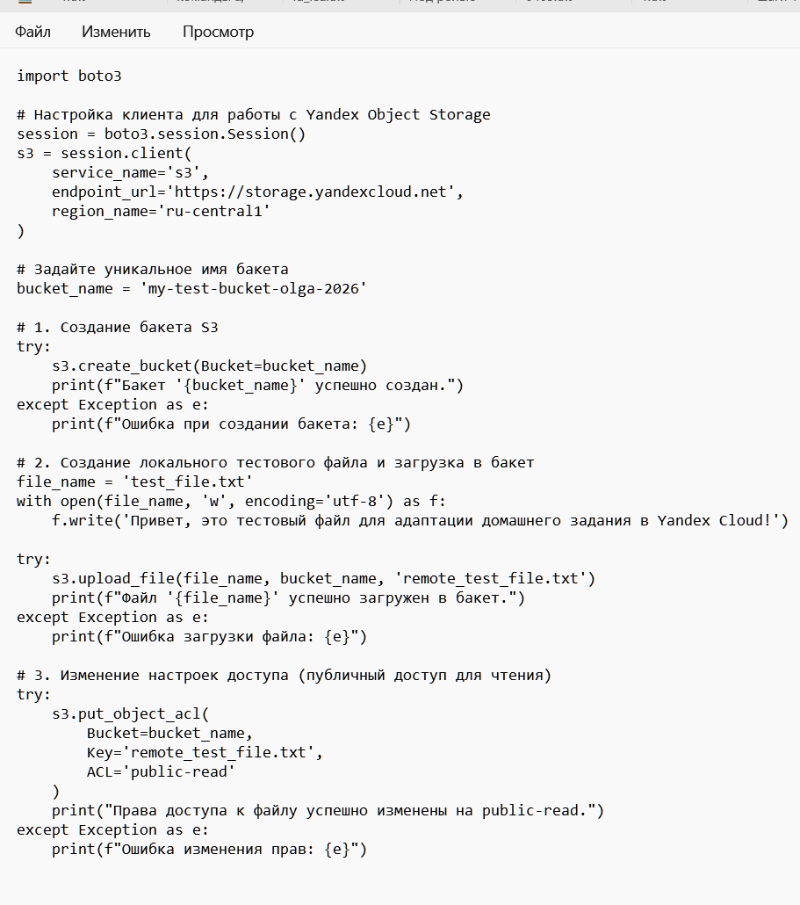

# отчет по выполнению задания L_36
## Задание 1: установка Yandex CLI / AWS CLI

## Задание 2: С помощью Boto3 создать бакет и загрузить файл

## Задание 3: С помощью phyton скрипта загрузить файл, проверить его наличие и выгрузить на компьютер

